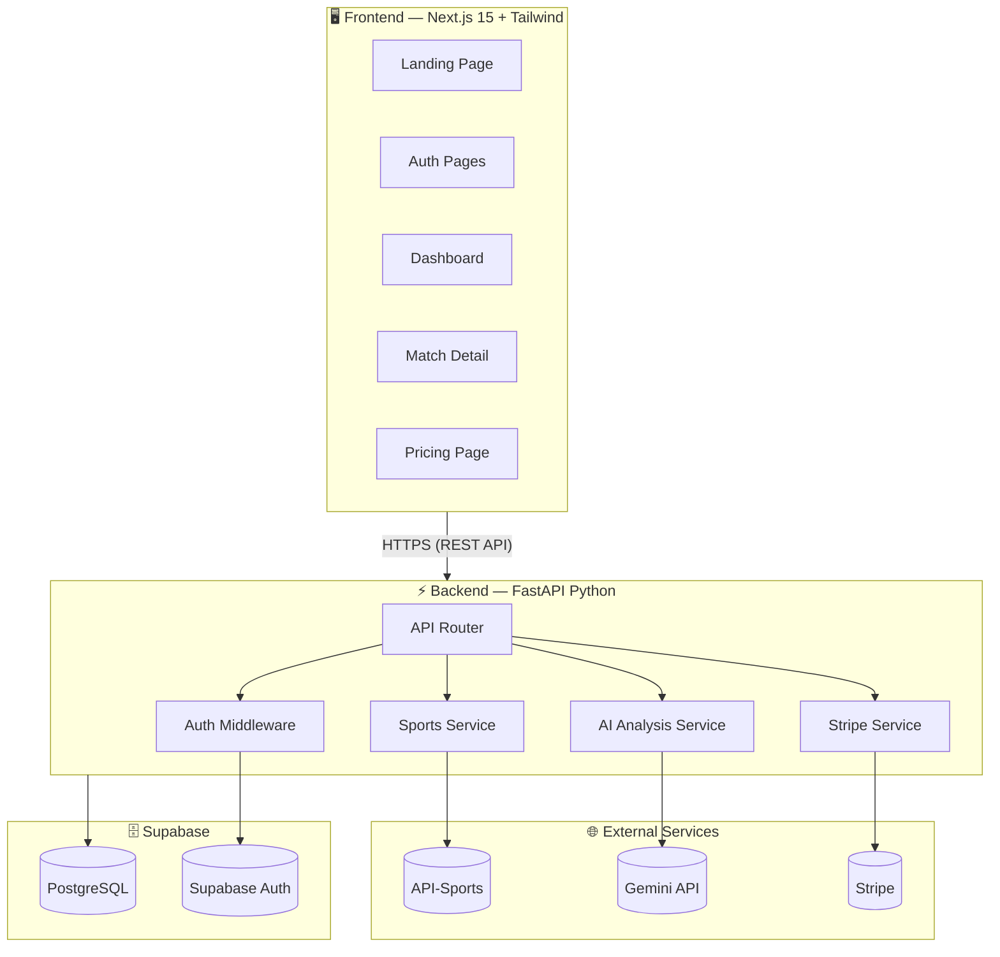
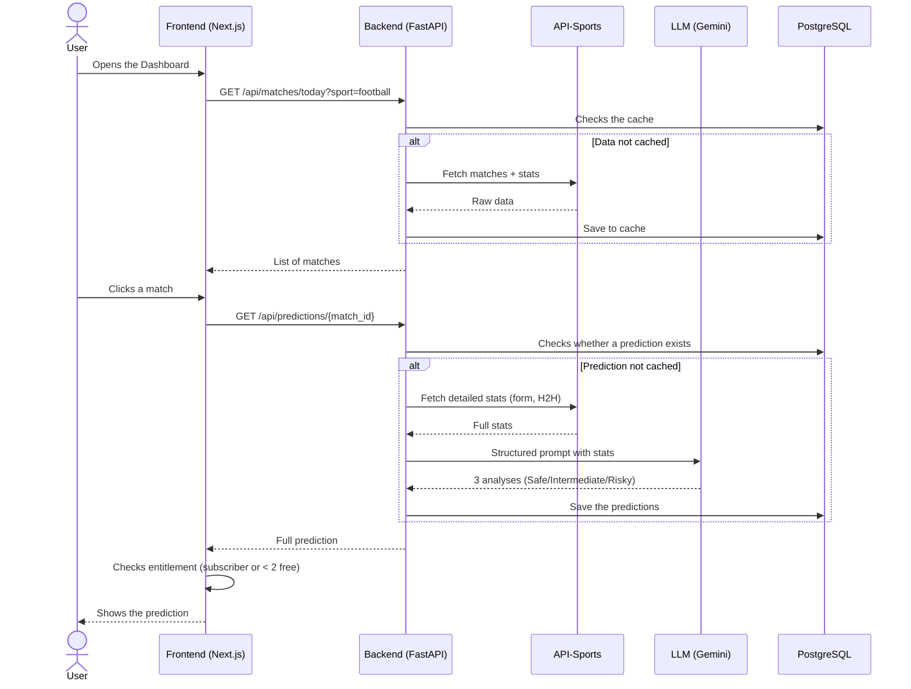

# 🏆 BETIX — Project Charter

> **Reference document** — this file is the project's compass. Every validated technical decision was recorded here. Originally meant to be consulted before each development phase.
>
> **Status note (added later): this is a historical planning snapshot from the project's start.** All 7 phases below were completed long ago, and the project has grown well beyond this original scope since (an on-demand AI generation engine replacing the batch approach described in Phase 4, a full dashboard rebuild, an admin panel, AI accuracy tracking, 4-language i18n, and more). For the current architecture, see [`README.md`](./README.md), [`backend/README.md`](./backend/README.md), and [`frontend/README.md`](./frontend/README.md) instead — this file is kept as a record of the original plan, not a live status page.

---

## 1. Project Overview

**BETIX** is a premium SaaS platform for sports predictions, powered by artificial intelligence.

| | |
|---|---|
| **Concept** | Turn raw sports statistics into written analysis and intelligent predictions via AI |
| **Type** | Production-ready MVP (not a prototype) |
| **Client** | Lilzer — subscription-based monetization |
| **Sports** | ⚽ Football · 🏀 Basketball · 🎾 Tennis |

### Key Features

- **User dashboard** — premium SaaS interface to browse today's matches and predictions
- **AI analysis engine** — fetches real data (stats, form, H2H) + LLM-driven analysis
- **3 confidence tiers** — Safe 🟢 · Intermediate 🟡 · Risky (high odds) 🔴
- **Stripe subscription system** — 2 free predictions, a €1 first-month intro offer, monthly/annual plans

---

## 2. Technical Decisions Made

### Tech Stack

| Layer | Technology | Rationale |
|---|---|---|
| **Frontend** | Next.js 15 (App Router) + Tailwind CSS + TypeScript | SEO, SSR, fast to build, rich ecosystem |
| **Backend** | Python FastAPI | Mature AI ecosystem, async performance, strong typing |
| **Database** | PostgreSQL via Supabase | Generous free tier (500 MB, 50k MAU), built-in auth |
| **Authentication** | Supabase Auth | Integrated with the DB, OAuth-ready, native JWT |
| **Payments** | Stripe (Checkout + Webhooks) | Industry standard, automatic subscription handling |
| **AI (dev/test, original plan)** | Google Gemini 2.0 Flash | Free within limits, good enough for the workflow *(superseded — see status note above; production now runs on Anthropic Claude)* |
| **AI (production, original plan)** | To be decided after comparative testing | Chosen on a quality/price/relevance basis *(decided: Claude Haiku, see backend/README.md §7)* |
| **Sports data** | API-Sports (api-sports.io) — Pro plan ~$30/month | One key for Football + Basketball + Tennis |

### Hosting

| Service | Platform | Cost |
|---|---|---|
| **Frontend** | Vercel (free tier) | $0 |
| **Backend** | Railway | ~$5-10/month |
| **Database** | Supabase (free tier) | $0 |

### Architecture: Separate Frontend & Backend

The frontend (Next.js) and backend (FastAPI) are two distinct projects communicating via REST API. This choice allows:
- Independent deployment of each part
- Flexible scalability
- The ability to replace one without touching the other

### AI Approach: Enriched Prompt Engineering

> No vector store or complex RAG architecture for the MVP.

The chosen approach:
1. **Fetch** stats via API-Sports (form, H2H, standings, injuries)
2. **Structure** that data into readable context
3. **Inject** the context into a sport-specific prompt
4. **Analyze** via the LLM to generate 3 prediction tiers

---

## 3. Overall Architecture

*(This diagram reflects the original design — e.g. Gemini as the AI provider. See the backend README for the current on-demand engine architecture.)*

### Main Flow: From Data to Prediction

---

## 4. Guiding Principles

1. **Production-ready** — no hacks. Clean code, solid architecture, polished UX
2. **Cost-optimized** — get the most out of free tiers without sacrificing quality
3. **Evolvable** — the DB schema, covered sports, and AI model will evolve as needed
4. **Mobile-first** — target users mostly browse on mobile
5. **Iterative** — don't try to define everything upfront; move component by component

---

## 5. Estimated Monthly Budget (MVP, original plan)

| Service | Cost |
|---|---|
| Vercel (Frontend) | **$0** |
| Railway (Backend) | **~$5-10** |
| Supabase (DB + Auth) | **$0** |
| API-Sports Pro | **~$30** |
| Gemini Flash (dev) | **$0** |
| Stripe | **2.9% + $0.30/transaction** |
| Domain | **~$1/month** (annualized) |
| **Total** | **~$36-41/month** + Stripe fees |

---

## 6. Original Development Plan

> **Design-first approach** — build the full interface with static data first, then wire up real data. The DB schema is driven by the app's actual needs, not the other way around.

### Phase 1 — Initialization & API Definition
- Set up the repos (Next.js + FastAPI)
- Configure the dev environment
- Explore and document the API-Sports endpoints (Football, Basketball, Tennis)
- Define data contracts: what data to fetch, in what shape
- Create the corresponding TypeScript types and Pydantic models

### Phase 2 — Frontend Design (Static Data)
- Define the branding (palette, typography, visual identity)
- Full design system (reusable UI components)
- **Every page built with mock data**:
  - Landing page (public showcase)
  - Auth pages (login, signup)
  - Dashboard (match list per sport)
  - Match detail page (full prediction with all 3 tiers)
  - Pricing page (plan comparison)
- Mobile-first responsive
- **Goal**: see 100% of the app and validate every feature before integration

### Phase 3 — Real Data & Database
- Integrate API-Sports into the backend (Football, Basketball, Tennis)
- Fetch real data + caching system
- **Build the optimal DB schema** based on real data AND actual UI needs
- Create the Supabase project + initial migration
- Replace mock data with real data in the frontend

### Phase 4 — AI Analysis Engine
- Integrate the Gemini API into the backend
- Create sport-specific prompts
- Generate the 3 prediction tiers (Safe / Intermediate / Risky)
- Cache predictions in the DB
- Connect to the frontend (prediction pages)

### Phase 5 — Authentication
- Configure Supabase Auth
- Working login/signup pages
- Route protection (Next.js middleware + backend JWT verification)
- User profile management

### Phase 6 — Monetization (Stripe)
- Integrate Stripe Checkout
- Create subscription plans (monthly, annual, €1 intro offer)
- Stripe webhooks (backend)
- Gate predictions: 2 free → paywall
- Pricing page connected to Stripe

### Phase 7 — Polish & Deployment
- End-to-end testing (full user flow)
- UX polish, animations, micro-interactions
- Final responsive pass and multi-device testing
- Production deployment (Vercel + Railway)
- Documentation and final configuration

---

*Last updated: February 11, 2026 (original document — see the status note at the top for what's changed since).*
