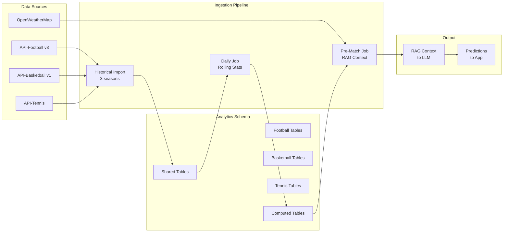

# 📚 Complete BETIX Data Schema Documentation

> **Status note (added later)**: this document is the original database design plan (its own header names two source design docs it was merged from). It's kept as a reference for the reasoning behind the schema, but several specifics have since evolved during actual implementation — confirmed this session:
> - **AI predictions storage**: the actual table is `public.ai_match_audits`, not the `public.predictions` design described in §3 of Part 1. It stores three ranked categories (`high_confidence`/`medium_confidence`/`risky`, 0-3 picks each) rather than one row per prediction with a single `type` field, adds `status`/`attempted_at`/`error_message`/`run_id`/`ai_provider`/`ai_model`/`graded_at`/`grading_results` columns for the on-demand generation lock and Phase 3 accuracy grading, and each pick carries a structured `outcome` field (not present in this design) used to auto-grade it against the real result.
> - **Confidence scoring**: production has the AI assign its own confidence score directly within a fixed range per category (80-99 / 60-79 / 30-59), rather than the deterministic malus-based formula in `analytics.confidence_factors` (§5 of Part 2) — that table's mechanism was not what shipped.
> - **`public.subscriptions`** gained a `has_used_trial` boolean flag (not listed in §4 of Part 1) to block a cancel/resubscribe trial-abuse loop.
> - **Pipeline cadence** (§6 of Part 2): actual cadences differ from the table below — live tracking runs every 5 minutes, the AI audit and grading passes run every 30 minutes, and match discovery runs on its own multi-hour cycle rather than the fixed daily/weekly times listed here.
>
> For the tables and columns actually in production, check the live schema directly (`supabase/migrations/`) rather than assuming this document is current — this is the design intent, not a live status page. See `backend/README.md` for the current AI engine and pipeline architecture.

This document archives the two pillars of BETIX's data architecture:
1.  **App Schema (`public.*`)**: UI-driven, handles users, subscriptions, and front-end display.
2.  **Analytics Schema (`analytics.*`)**: AI-driven, handles sports data pipelines and predictive models.

---

# PART 1: App Database Architecture (UI-Driven)
*Source: database_schema_design.md*

This schema was custom-designed to meet the exact needs identified during the audit of the app's 4 zones (Public, Auth, Dashboard, Admin). It follows a "UI-Driven" philosophy: every table serves a visual component directly.

---

## 🏗️ 1. Users & Auth Module
*Extends Supabase's system `auth.users` table.*

### `public.profiles`
*Stores public identity and preferences.*
| Column | Type | Description | UI Source |
| :--- | :--- | :--- | :--- |
| `id` | `uuid` (PK) | FK to `auth.users.id`. | Auth |
| `username` | `text` | Unique handle. | Signup / Profile |
| `avatar_url` | `text` | Profile image URL. | Profile (Hero) |
| `role` | `text` | 'user', 'admin', 'super_admin'. | Admin Users |
| `onboarding_completed` | `boolean` | If false -> redirect to `/onboarding`. | Onboarding |
| `betting_style` | `text` | 'casual', 'regular', 'analytical'. | Onboarding (Step 2) |
| `favorite_sports` | `text[]` | Array of IDs: ['football', 'tennis']. | Onboarding (Step 1) |
| `created_at` | `timestamptz` | Signup date. | Admin / Profile |
| `deleted_at` | `timestamptz` | Soft delete (GDPR/archiving). | Admin Safety |

### `public.user_settings`
*Technical preferences (Control Deck).*
| Column | Type | Description | UI Source |
| :--- | :--- | :--- | :--- |
| `user_id` | `uuid` (PK) | FK to `profiles.id`. | |
| `theme` | `text` | 'light', 'dark', 'system'. | Profile (Settings) |
| `notifications_push` | `boolean` | Toggle push notifications. | Profile (Settings) |
| `newsletter_opt_in` | `boolean` | Email subscription. | Profile (Settings) |

---

## 🎮 2. Gamification & Stats Module
*Powers the "Performance Center" and the profile header.*

### `public.user_stats`
*Computed aggregates (avoids recalculating on every view).*
| Column | Type | Description | UI Source |
| :--- | :--- | :--- | :--- |
| `user_id` | `uuid` (PK) | FK to `profiles.id`. | |
| `level` | `int` | Current level (e.g. 42). | Profile (Hero) |
| `xp_current` | `int` | Accumulated XP. | Profile (Progress Bar) |
| `xp_next` | `int` | XP required for the next level. | Profile (Progress Bar) |
| `total_bets` | `int` | Total tracked bets. | Profile Stats |
| `win_rate` | `float` | Success % (0-100). | Profile Stats |
| `roi` | `float` | Return on investment %. | Profile Stats |
| `current_streak` | `int` | Current streak (+Win / -Loss). | Profile Stats |
| `total_profit` | `decimal` | Net winnings. | Profile Stats |

### `public.badges`
*Definitions of available trophies.*
| Column | Type | Description | UI Source |
| :--- | :--- | :--- | :--- |
| `id` | `text` (PK) | Slug (e.g. 'sharpshooter'). | |
| `name` | `text` | Display name (e.g. "Sniper"). | Profile Badges |
| `description` | `text` | Unlock condition. | Profile Badges |
| `icon_ref` | `text` | Lucide icon name. | Profile Badges |
| `rarity` | `text` | 'common', 'rare', 'epic', 'legendary'. | Profile Badges |

### `public.user_badges`
*User <-> Badges link table.*
| Column | Type | Description | UI Source |
| :--- | :--- | :--- | :--- |
| `user_id` | `uuid` (PK) | FK `profiles`. | |
| `badge_id` | `text` (PK) | FK `badges`. | |
| `unlocked_at` | `timestamptz` | Date unlocked. | Profile Badges |

---

## ⚽ 3. Betting Engine Module (Simplified)
*Powers the Dashboard and Match List.*
*Note: detailed data (lineups, h2h) is stored as JSONB or via API-Sports.*

### `public.matches`
| Column | Type | Description | UI Source |
| :--- | :--- | :--- | :--- |
| `id` | `uuid` (PK) | Internal ID. | |
| `api_sport_id` | `text` | External ID (API-Sports). | Mapping |
| `sport` | `text` | 'football', 'basketball', 'tennis'. | Filters, Icons |
| `league_name` | `text` | Competition name. | MatchCard Header |
| `home_team` | `jsonb` | { "name": "Arsenal", "logo": "url", "code": "ARS" }. | MatchCard |
| `away_team` | `jsonb` | { "name": "Chelsea", "logo": "url", "code": "CHE" }. | MatchCard |
| `date_time` | `timestamptz` | Kickoff time. | Dashboard Sort |
| `status` | `text` | 'upcoming', 'live', 'finished'. | MatchCard Badge |
| `score` | `jsonb` | { "home": 2, "away": 1, "mtime": "45+2'" }. | MatchCard Live |
| `tournament_meta` | `jsonb` | { "group": "A", "round": "Semi-Final", "neutral_ground": true }. | Match Detail |

### `public.predictions` *(design intent — see status note: shipped as `public.ai_match_audits` instead)*
*AI-generated analyses.*
| Column | Type | Description | UI Source |
| :--- | :--- | :--- | :--- |
| `id` | `uuid` (PK) | | |
| `match_id` | `uuid` | FK `matches`. | |
| `type` | `text` | 'safe', 'value', 'risky'. | MatchCard Badge |
| `confidence` | `int` | 0-100. | MatchCard Badge |
| `outcome` | `text` | The pick (e.g. "Over 2.5 goals"). | Landing Demo |
| `odds` | `float` | The odds at prediction time. | Landing Demo |
| `analysis_short` | `text` | Summary for cards/lists. | Landing Demo |
| `analysis_full` | `text` | Detailed analysis (Markdown). | Match Detail |
| `generation_snapshot` | `jsonb` | Score/time at prediction time (integrity proof). | Admin / Debug |
| `is_locked` | `boolean` | True if Premium-gated. | Gating Rules |

---

## 💳 4. Subscriptions Module
*Access and plan management.*

### `public.plans`
| Column | Type | Description | UI Source |
| :--- | :--- | :--- | :--- |
| `id` | `text` (PK) | 'free', 'premium_monthly', 'premium_annual'. | Pricing Page |
| `name` | `text` | Commercial name ("The Insider"). | Pricing Page |
| `price` | `decimal` | Displayed price. | Pricing Page |
| `stripe_price_id` | `text` | Stripe Checkout ID. | Backend |
| `features` | `jsonb` | List of benefits. | Pricing Page |

### `public.subscriptions`
| Column | Type | Description | UI Source |
| :--- | :--- | :--- | :--- |
| `user_id` | `uuid` (PK) | FK `profiles`. | |
| `plan_id` | `text` | FK `plans`. | Profile Season Pass |
| `status` | `text` | 'active', 'past_due', 'canceled'. | Profile Season Pass, Admin |
| `current_period_end` | `timestamptz` | Expiration/renewal date. | Profile Season Pass |
| `source` | `text` | 'stripe' or 'manual_gift' (Admin). | Admin Override |
| `stripe_subscription_id` | `text` (Nullable) | Stripe technical ID (empty for gifts). | Admin Settings |
| `has_used_trial` | `boolean` | *(added post-design)* Blocks repeat trial discounts on cancel/resubscribe. | Trial gating |

---

## 🛠️ 5. Admin & Logs Module
*System oversight.*

### `public.system_logs`
| Column | Type | Description | UI Source |
| :--- | :--- | :--- | :--- |
| `id` | `bigint` (PK) | | |
| `created_at` | `timestamptz` | Timestamp. | Admin Terminal |
| `level` | `text` | 'info', 'warning', 'error', 'critical'. | Admin Terminal / Notifs |
| `source` | `text` | 'api-sports', 'stripe', 'ai-engine'. | Admin Terminal |
| `message` | `text` | Log content. | Admin Terminal |

### `public.app_config`
*Live configuration (feature flags).*
| Column | Type | Description | UI Source |
| :--- | :--- | :--- | :--- |
| `key` | `text` (PK) | e.g. 'maintenance_mode', 'signup_enabled'. | Admin Settings |
| `value` | `jsonb` | Setting value. | Admin Settings |
| `description` | `text` | Admin-facing help text. | Admin Settings |

---
---

# PART 2: Data Schema — AI Analysis Engine (Multi-Sport)
*Source: sports_analytics_schema.md*

This schema is **separate** from the app schema. It exclusively feeds the **AI prediction engine** and its data pipelines. It's designed to store, compute, and serve the data needed for expert-level analysis across all 3 sports: Football, Basketball, and Tennis.

> [!IMPORTANT]
> This schema coexists with the App schema (Users, Subscriptions, etc.) in the same Supabase database. The tables below are prefixed `analytics.*` to distinguish them.

---

## 🏗️ Overall Architecture

---

## 📦 1. Shared Tables (Cross-Sport)

### `analytics.leagues`
*Reference table of covered competitions.*
| Column | Type | Description |
| :--- | :--- | :--- |
| `id` | `serial` PK | Internal ID |
| `api_id` | `int` | External ID (API-Sports / API-Tennis) |
| `sport` | `text` | `football`, `basketball`, `tennis` |
| `name` | `text` | E.g. "Premier League", "NBA", "ATP" |
| `country` | `text` | E.g. "England", "USA", "International" |
| `tier` | `text` | `major`, `minor`, `challenger` — affects the Confidence Score |
| `season_start` | `date` | Season start |
| `season_end` | `date` | Season end |

### `analytics.teams`
*Reference table of teams (Football & Basketball).*
| Column | Type | Description |
| :--- | :--- | :--- |
| `id` | `serial` PK | Internal ID |
| `api_id` | `int` | External API-Sports ID |
| `sport` | `text` | `football`, `basketball` |
| `name` | `text` | Full name |
| `short_name` | `text` | Short code (e.g. "ARS", "LAL") |
| `logo_url` | `text` | Logo URL |
| `league_id` | `int` FK | Current league |
| `stadium_city` | `text` | Stadium city (for weather & travel) |
| `stadium_lat` | `decimal(9,6)` | Latitude (for distance calc) |
| `stadium_lon` | `decimal(9,6)` | Longitude |

### `analytics.players`
*Reference table of players (Tennis = individual, Football/Basketball = key players).*
| Column | Type | Description |
| :--- | :--- | :--- |
| `id` | `serial` PK | Internal ID |
| `api_id` | `int` | External ID |
| `sport` | `text` | `football`, `basketball`, `tennis` |
| `name` | `text` | Full name |
| `team_id` | `int` FK (Nullable) | FK `teams` (NULL for Tennis) |
| `position` | `text` | E.g. "Forward", "Guard", null (Tennis) |

### `analytics.odds_snapshots`
*Pre-match odds history (market sentiment).*
| Column | Type | Description |
| :--- | :--- | :--- |
| `id` | `bigserial` PK | |
| `match_id` | `int` FK | FK to the relevant sport's match table |
| `sport` | `text` | `football`, `basketball`, `tennis` |
| `bookmaker` | `text` | E.g. "Bet365", "Unibet" |
| `snapshot_at` | `timestamptz` | Capture time |
| `home_win` | `decimal(5,2)` | Home win / player 1 odds |
| `draw` | `decimal(5,2)` | Draw odds (NULL for Tennis/Basketball) |
| `away_win` | `decimal(5,2)` | Away win / player 2 odds |
| `over_under_line` | `decimal(4,1)` | Over/Under line (e.g. 2.5 goals, 210.5 pts) |
| `over_odds` | `decimal(5,2)` | Over odds |
| `under_odds` | `decimal(5,2)` | Under odds |

---

## ⚽ 2. Football Tables

### `analytics.football_matches`
| Column | Type | Description |
| :--- | :--- | :--- |
| `id` | `serial` PK | |
| `api_id` | `int` UNIQUE | API-Football fixture ID |
| `league_id` | `int` FK | FK `leagues` |
| `round` | `text` | E.g. "Regular Season - 15", "Semi-Final" |
| `date_time` | `timestamptz` | Kickoff |
| `home_team_id` | `int` FK | FK `teams` |
| `away_team_id` | `int` FK | FK `teams` |
| `home_score` | `int` | Final score (NULL if not played) |
| `away_score` | `int` | |
| `status` | `text` | `scheduled`, `live`, `finished`, `postponed` |
| `referee_name` | `text` | Referee name (if known) |
| `weather` | `jsonb` | `{"condition": "Rain", "temp_c": 12, "wind_ms": 8}` |

### `analytics.football_match_stats`
*Per-team, per-match stats — raw API data.*
| Column | Type | Description |
| :--- | :--- | :--- |
| `match_id` | `int` FK | Composite PK |
| `team_id` | `int` FK | Composite PK |
| `possession_pct` | `decimal(4,1)` | Possession % |
| `shots_on_goal` | `int` | Shots on target |
| `shots_total` | `int` | Total shots |
| `passes_total` | `int` | Passes attempted |
| `passes_accurate` | `int` | Passes completed |
| `fouls` | `int` | Fouls committed |
| `corners` | `int` | Corners |
| `yellow_cards` | `int` | Yellow cards |
| `red_cards` | `int` | Red cards |
| `expected_goals` | `decimal(4,2)` | xG (NULL for minor leagues) |

### `analytics.football_injuries`
| Column | Type | Description |
| :--- | :--- | :--- |
| `id` | `serial` PK | |
| `player_id` | `int` FK | FK `players` |
| `team_id` | `int` FK | FK `teams` |
| `match_id` | `int` FK | Relevant match (NULL for a training injury) |
| `type` | `text` | `injury`, `suspension`, `other` |
| `reason` | `text` | E.g. "Hamstring", "Red Card" |
| `status` | `text` | `out`, `doubtful`, `day_to_day` |
| `reported_at` | `date` | Report date |

### `analytics.football_h2h`
*Head-to-head aggregate.*
| Column | Type | Description |
| :--- | :--- | :--- |
| `team_a_id` | `int` FK | Composite PK (lower ID) |
| `team_b_id` | `int` FK | Composite PK |
| `total_matches` | `int` | |
| `team_a_wins` | `int` | |
| `draws` | `int` | |
| `team_b_wins` | `int` | |
| `avg_goals_a` | `decimal(3,1)` | Team A average goals |
| `avg_goals_b` | `decimal(3,1)` | |
| `last_5_results` | `jsonb` | `["W", "D", "L", "W", "W"]` (from A's perspective) |
| `updated_at` | `timestamptz` | |

### `analytics.football_team_rolling`
*Rolling stats, recalculated daily.*
| Column | Type | Description |
| :--- | :--- | :--- |
| `team_id` | `int` FK | Composite PK |
| `date` | `date` | Composite PK |
| `venue` | `text` | Composite PK: `home`, `away`, `all` |
| `l5_points` | `int` | Points over the last 5 matches |
| `l5_ppm` | `decimal(3,2)` | Points per match |
| `l5_goals_for` | `decimal(3,1)` | Goals scored (avg.) |
| `l5_goals_against` | `decimal(3,1)` | Goals conceded (avg.) |
| `l5_clean_sheets` | `int` | Clean sheets in the last 5 |
| `l5_xg_for` | `decimal(3,1)` | Average xG (NULL if unavailable) |
| `l5_xg_against` | `decimal(3,1)` | Average xGA |
| `l5_possession_avg` | `decimal(4,1)` | Average possession % |
| `l5_pass_accuracy` | `decimal(4,1)` | Pass completion % |
| `l5_shots_avg` | `decimal(3,1)` | Shots per match |

### `analytics.football_team_elo`
*In-house ELO ratings, recalculated after every match.*
| Column | Type | Description |
| :--- | :--- | :--- |
| `team_id` | `int` FK | Composite PK |
| `date` | `date` | Composite PK |
| `elo_rating` | `decimal(6,1)` | ELO rating (base: 1500) |
| `elo_change_1m` | `decimal(5,1)` | 1-month change |

### `analytics.football_referee_stats`
*Referee tendency aggregate (recalculated monthly).*
| Column | Type | Description |
| :--- | :--- | :--- |
| `referee_name` | `text` PK | |
| `season` | `int` | Composite PK |
| `matches_officiated` | `int` | |
| `avg_yellow_cards` | `decimal(3,1)` | Per match |
| `avg_red_cards` | `decimal(3,2)` | Per match |
| `avg_fouls` | `decimal(4,1)` | Per match |
| `avg_penalties` | `decimal(3,2)` | Per match |

---

## 🏀 3. Basketball Tables

### `analytics.basketball_matches`
| Column | Type | Description |
| :--- | :--- | :--- |
| `id` | `serial` PK | |
| `api_id` | `int` UNIQUE | API-Basketball game ID |
| `league_id` | `int` FK | FK `leagues` |
| `date_time` | `timestamptz` | Tip-off |
| `home_team_id` | `int` FK | |
| `away_team_id` | `int` FK | |
| `home_score` | `int` | Final score |
| `away_score` | `int` | |
| `score_q1` | `jsonb` | `{"home": 28, "away": 25}` |
| `score_q2` | `jsonb` | |
| `score_q3` | `jsonb` | |
| `score_q4` | `jsonb` | |
| `score_ot` | `jsonb` | Overtime (NULL if none) |
| `status` | `text` | `scheduled`, `live`, `finished` |

### `analytics.basketball_match_stats`
*Per-team, per-match stats.*
| Column | Type | Description |
| :--- | :--- | :--- |
| `match_id` | `int` FK | Composite PK |
| `team_id` | `int` FK | Composite PK |
| `fga` | `int` | Field Goals Attempted |
| `fgm` | `int` | Field Goals Made |
| `tpa` | `int` | 3-Point Attempted |
| `tpm` | `int` | 3-Point Made |
| `fta` | `int` | Free Throws Attempted |
| `ftm` | `int` | Free Throws Made |
| `off_rebounds` | `int` | Offensive rebounds |
| `def_rebounds` | `int` | Defensive rebounds |
| `assists` | `int` | Assists |
| `turnovers` | `int` | Turnovers |
| `steals` | `int` | Steals |
| `blocks` | `int` | Blocks |
| `fouls` | `int` | Fouls |
| **Computed** | | |
| `possessions` | `decimal(5,1)` | Dean Oliver formula |
| `ortg` | `decimal(5,1)` | Offensive rating (pts/100 poss) |
| `drtg` | `decimal(5,1)` | Defensive rating |
| `efg_pct` | `decimal(4,1)` | Effective FG% |
| `tov_pct` | `decimal(4,1)` | Turnover % |
| `orb_pct` | `decimal(4,1)` | Offensive rebound % |
| `ftr` | `decimal(4,1)` | Free throw rate |

### `analytics.basketball_injuries`
| Column | Type | Description |
| :--- | :--- | :--- |
| `id` | `serial` PK | |
| `player_id` | `int` FK | |
| `team_id` | `int` FK | |
| `status` | `text` | `out`, `gtd` (Game Time Decision), `probable` |
| `reason` | `text` | E.g. "Knee", "Rest (Load Management)" |
| `ppg_impact` | `decimal(4,1)` | Points/game lost |
| `usg_pct` | `decimal(4,1)` | Player usage rate (% of possessions) |
| `reported_at` | `date` | |

### `analytics.basketball_team_rolling`
*Rolling stats + fatigue.*
| Column | Type | Description |
| :--- | :--- | :--- |
| `team_id` | `int` FK | Composite PK |
| `date` | `date` | Composite PK |
| `venue` | `text` | Composite PK: `home`, `away`, `all` |
| `l5_ortg` | `decimal(5,1)` | Offensive rating L5 |
| `l5_drtg` | `decimal(5,1)` | Defensive rating L5 |
| `l5_net_rtg` | `decimal(5,1)` | Net rating L5 |
| `l5_pace` | `decimal(5,1)` | Pace L5 |
| `l5_efg_pct` | `decimal(4,1)` | eFG% L5 |
| `l10_ortg` | `decimal(5,1)` | Offensive rating L10 |
| `l10_drtg` | `decimal(5,1)` | Defensive rating L10 |
| `l10_net_rtg` | `decimal(5,1)` | Net rating L10 |
| `season_ortg` | `decimal(5,1)` | Season offensive rating |
| `season_drtg` | `decimal(5,1)` | Season defensive rating |
| `rest_days` | `int` | Days since last game |
| `is_b2b` | `boolean` | Back-to-back flag |
| `games_in_7_days` | `int` | Games played in the last 7 days |

### `analytics.basketball_h2h`
| Column | Type | Description |
| :--- | :--- | :--- |
| `team_a_id` | `int` FK | Composite PK |
| `team_b_id` | `int` FK | Composite PK |
| `season` | `int` | Composite PK |
| `games_played` | `int` | |
| `team_a_wins` | `int` | |
| `avg_margin` | `decimal(4,1)` | Average margin |
| `last_results` | `jsonb` | `[{"date": "...", "score": "110-105", "winner": "A"}]` |
| `updated_at` | `timestamptz` | |

---

## 🎾 4. Tennis Tables

### `analytics.tennis_tournaments`
*Tournament reference table (critical for the Confidence Score).*
| Column | Type | Description |
| :--- | :--- | :--- |
| `id` | `serial` PK | |
| `api_id` | `int` UNIQUE | |
| `name` | `text` | E.g. "Roland Garros", "Paris Masters" |
| `category` | `text` | `grand_slam`, `masters_1000`, `atp_500`, `atp_250`, `challenger`, `itf` |
| `surface` | `text` | `clay`, `hard`, `grass` |
| `indoor_outdoor` | `text` | `indoor`, `outdoor` |
| `prize_money_usd` | `int` | |

### `analytics.tennis_matches`
| Column | Type | Description |
| :--- | :--- | :--- |
| `id` | `serial` PK | |
| `api_id` | `int` UNIQUE | |
| `tournament_id` | `int` FK | FK `tennis_tournaments` |
| `round` | `text` | E.g. "Final", "R16", "Q2" |
| `date_time` | `timestamptz` | |
| `player1_id` | `int` FK | FK `players` |
| `player2_id` | `int` FK | FK `players` |
| `winner_id` | `int` FK | NULL if not played |
| `score` | `text` | E.g. "6-4, 3-6, 7-6(5)" |
| `duration_minutes` | `int` | |
| `sets_played` | `int` | |
| `status` | `text` | `scheduled`, `live`, `finished`, `retired`, `walkover` |
| `surface` | `text` | Denormalized from tournament for perf |
| `indoor_outdoor` | `text` | Denormalized |

### `analytics.tennis_match_stats`
*Per-player, per-match stats.*
| Column | Type | Description |
| :--- | :--- | :--- |
| `match_id` | `int` FK | Composite PK |
| `player_id` | `int` FK | Composite PK |
| `aces` | `int` | |
| `double_faults` | `int` | |
| `first_serve_pct` | `decimal(4,1)` | 1st serve % |
| `first_serve_won_pct` | `decimal(4,1)` | Points won behind 1st serve % |
| `second_serve_won_pct` | `decimal(4,1)` | Points won behind 2nd serve % |
| `bp_saved_pct` | `decimal(4,1)` | Break points saved % |
| `bp_converted_pct` | `decimal(4,1)` | Break points converted % |
| `total_points_won` | `int` | Total points won |
| **Computed** | | |
| `return_won_pct` | `decimal(4,1)` | Derived: `(total_pts - serve_pts) / opp_serve_pts` |
| `service_games_held` | `int` | Service games held (from score) |
| `return_games_won` | `int` | Breaks achieved (from score) |

### `analytics.tennis_player_rolling`
*Rolling stats by surface + fatigue.*
| Column | Type | Description |
| :--- | :--- | :--- |
| `player_id` | `int` FK | Composite PK |
| `surface` | `text` | Composite PK: `clay`, `hard`, `grass`, `all` |
| `date` | `date` | Composite PK |
| `l5_win_pct` | `decimal(4,1)` | Win% L5 on this surface |
| `l10_win_pct` | `decimal(4,1)` | Win% L10 |
| `season_win_pct` | `decimal(4,1)` | Season win% |
| `l10_aces_avg` | `decimal(4,1)` | Aces/match L10 |
| `l10_first_serve_pct` | `decimal(4,1)` | 1st serve % L10 |
| `l10_first_serve_won` | `decimal(4,1)` | Points won on 1st serve L10 |
| `l10_bp_saved_pct` | `decimal(4,1)` | BP saved % L10 |
| `l10_return_won_pct` | `decimal(4,1)` | Return rating L10 |
| `l10_bp_converted_pct` | `decimal(4,1)` | BP converted % L10 |
| `days_since_last_match` | `int` | Rest |
| `sets_played_l7` | `int` | Sets played in the last 7 days |
| `minutes_played_l7` | `int` | Minutes played in the last 7 days |
| `fatigue_score` | `int` | 0-100 (100 = exhausted) |

### `analytics.tennis_h2h`
*Head-to-head with surface filtering.*
| Column | Type | Description |
| :--- | :--- | :--- |
| `player_a_id` | `int` FK | Composite PK (lower ID) |
| `player_b_id` | `int` FK | Composite PK |
| `total_wins_a` | `int` | |
| `total_wins_b` | `int` | |
| `clay_wins_a` | `int` | A's wins on clay |
| `clay_wins_b` | `int` | |
| `hard_wins_a` | `int` | |
| `hard_wins_b` | `int` | |
| `grass_wins_a` | `int` | |
| `grass_wins_b` | `int` | |
| `indoor_wins_a` | `int` | |
| `indoor_wins_b` | `int` | |
| `last_meeting_date` | `date` | |
| `last_winner_id` | `int` FK | |
| `last_score` | `text` | |
| `updated_at` | `timestamptz` | |

### `analytics.tennis_rankings`
*Weekly snapshots for computing momentum.*
| Column | Type | Description |
| :--- | :--- | :--- |
| `player_id` | `int` FK | Composite PK |
| `date` | `date` | Composite PK (Monday of each week) |
| `rank` | `int` | ATP/WTA ranking |
| `points` | `int` | ATP/WTA points |
| `rank_change_1m` | `int` | 1-month rank change |
| `rank_change_3m` | `int` | 3-month rank change |
| `trend` | `text` | `rising`, `stable`, `declining` |

---

## 🧮 5. Confidence Table (Cross-Sport)

### `analytics.confidence_factors` *(design intent — see status note: production has the AI assign its own score per category instead)*
*Modulation factors for each prediction's Confidence Score.*
| Column | Type | Description |
| :--- | :--- | :--- |
| `id` | `serial` PK | |
| `match_id` | `int` | Match ID (sport inferred via `sport`) |
| `sport` | `text` | `football`, `basketball`, `tennis` |
| `base_score` | `int` | 100 (base) |
| `league_tier_malus` | `int` | -30 for ITF/Challenger, -15 for minor leagues |
| `missing_data_malus` | `int` | -20 if xG or stats are missing |
| `h2h_malus` | `int` | -10 if no H2H |
| `injury_uncertainty_malus` | `int` | -10 if an unresolved GTD |
| `final_score` | `int` | Final computed score (0-100) |
| `computed_at` | `timestamptz` | |

---

## 🔄 6. Update Pipeline *(design intent — see status note for actual production cadences)*

| Job | Frequency | Action |
| :--- | :--- | :--- |
| **Historical Import** | One-time | 3 seasons (2023-2025) for all 3 sports |
| **Daily Sync** | 1x/day (06:00) | Import today's matches, yesterday's results |
| **Rolling Stats** | 1x/day (06:30) | Recompute L5/L10/Season for all teams/players |
| **ELO Update** | After every match | Update ELO ratings (Football) |
| **H2H Refresh** | After every match | Update H2H aggregates |
| **Referee Stats** | 1x/month | Recompute referee tendencies |
| **Rankings** | 1x/week (Monday) | Tennis rankings snapshot |
| **Pre-Match Context** | H-2 before match | Compile RAG context + fetch weather |
| **Odds Tracking** | H-24 → H-1 | Odds snapshots every 6h |
