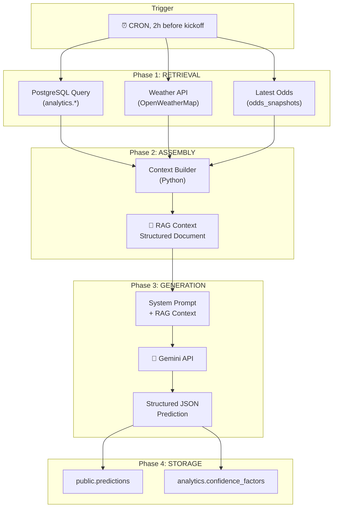
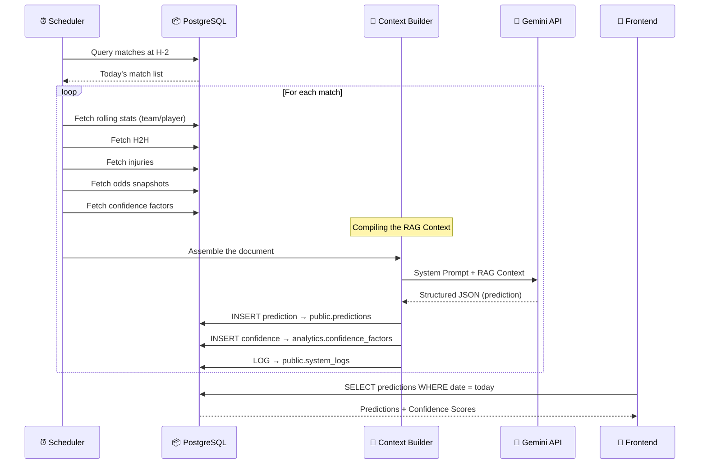

# 🧠 RAG Methodology — BETIX AI Prediction Engine

> **Status note (added later)**: this document describes the *original design concept* for the prediction pipeline, written before it was built. The guiding principles below (context-first, no hallucination, surface-aware tennis analysis, fatigue-aware basketball analysis, one LLM call per prediction) still hold — but several concrete specifics changed during actual implementation:
> - **Storage**: a single `public.ai_match_audits` table (with a `status` lock for pending/ready/failed and a `run_id='live'` single-row-per-match model), not the separate `public.predictions` + `analytics.confidence_factors` tables described below.
> - **Output shape**: three ranked categories (`high_confidence` / `medium_confidence` / `risky`, 0-3 picks each) with the AI assigning its own confidence score *within* a fixed range per category (80-99 / 60-79 / 30-59), not the single `type`/`confidence` field and separate malus-based scoring formula described in §"Confidence Score Mechanism" below. Each pick also carries a structured `outcome` field (e.g. `{"type": "moneyline", "side": "home"}`) not mentioned here, used to automatically grade the pick against the real result once the match finishes.
> - **Trigger**: a 24-hour-lookahead proactive scan plus an on-demand fallback when a premium user opens an ungenerated match — not a fixed H-2 CRON.
> - **Provider**: Anthropic Claude in production, not Gemini.
>
> See `backend/README.md` §7 for the current, accurate architecture. This file is kept for the original design thinking.
>
> **RAG = Retrieval-Augmented Generation**
> The LLM doesn't guess. It **reads an analyst's dossier**, compiled automatically, then writes its verdict.

---

## 📐 Overall RAG Pipeline Architecture



### Core Principle

The LLM **never accesses external APIs directly**. It receives a **pre-compiled context document** (the "RAG Context") containing all the necessary data, structured and verified. This guarantees:

1. **Reproducibility** — the same context produces the same analysis
2. **Traceability** — `generation_snapshot` stores the exact context used
3. **Cost control** — one LLM call per prediction, no tool chains
4. **Quality** — data is cleaned and validated before reaching the LLM

---

## ⚽ Football RAG

### Data Sources Used

| Data | Source Table | Window |
|:---|:---|:---|
| Recent form (home/away) | `football_team_rolling` | L5 matches |
| xG / xGA | `football_team_rolling` | L5 (major leagues) |
| ELO rating | `football_team_elo` | Latest snapshot |
| Injuries / suspensions | `football_injuries` | Active status |
| Head-to-head | `football_h2h` | Full history |
| Referee tendencies | `football_referee_stats` | Current season |
| Stadium weather | Live fetch (OpenWeatherMap) | 2h before |
| Odds movement | `odds_snapshots` | 24h → 1h before |
| Tournament context | `football_matches.round` | Current match |

### RAG Context Structure (Football)

```markdown
## 🏟️ MATCH CONTEXT
- Competition: Premier League — Matchday 25
- Date: 2025-02-15 15:00 UTC
- Venue: Emirates Stadium, London (Home: Arsenal)
- Referee: Michael Oliver (Season: 3.2 yellows/match, 0.31 penalties/match)
- Weather: Cloudy, 8°C, Wind 12 km/h

## 📊 HOME TEAM: ARSENAL (ELO: 1824, +45 last month)
### Form (Last 5 Home): W-W-D-W-W | PPM: 2.60
- Goals For: 2.4/match | Goals Against: 0.6/match
- xG: 2.1/match | xGA: 0.8/match | Clean Sheets: 3/5
- Possession: 62.4% | Pass Accuracy: 88.2%
### Key Absences:
- Bukayo Saka (Hamstring) — OUT | Impact: Key creator
- Martin Ødegaard (Knee) — DOUBTFUL

## 📊 AWAY TEAM: CHELSEA (ELO: 1756, -12 last month)
### Form (Last 5 Away): L-W-L-D-W | PPM: 1.40
- Goals For: 1.2/match | Goals Against: 1.6/match
- xG: 1.3/match | xGA: 1.5/match | Clean Sheets: 1/5
- Possession: 55.1% | Pass Accuracy: 84.7%
### Key Absences:
- None reported

## 🔄 HEAD-TO-HEAD (Last 20 meetings)
- Arsenal: 9W | Draws: 5 | Chelsea: 6W
- Avg Goals Arsenal: 1.6 | Avg Goals Chelsea: 1.1
- Last 5: [W, D, L, W, W] (Arsenal perspective)

## 💰 MARKET SENTIMENT (Odds Movement 24h → 1h before)
- Arsenal Win: 1.65 → 1.58 (SHORTENING — Money on Arsenal)
- Draw: 3.80 → 4.00 (DRIFTING)
- Chelsea Win: 5.50 → 5.80 (DRIFTING)
- Over 2.5: 1.75 → 1.70 (SHORTENING)
```

### System Prompt (Football)

```
You are a senior sports analyst specialized in football.
You receive a pre-match analysis dossier. Your role:

1. ANALYZE the factual data in the dossier
2. IDENTIFY the key factors (form, xG, absences, H2H, weather, odds)
3. PRODUCE a structured JSON prediction

Rules:
- Never invent data not present in the dossier
- If xG = NULL, mention that the analysis is based on classic stats
- Weight recent form > H2H history > odds
- The Confidence Score reflects data QUALITY, not your certainty

Output format:
{
  "type": "safe|value|risky",
  "confidence": 0-100,
  "outcome": "Bet description",
  "odds": 1.XX,
  "analysis_short": "1-line summary",
  "analysis_full": "Detailed analysis in Markdown (3-5 paragraphs)"
}
```

---

## 🏀 Basketball RAG

### Data Sources Used

| Data | Source Table | Window |
|:---|:---|:---|
| Off/Def Ratings | `basketball_team_rolling` | L5, L10, Season |
| Four Factors (eFG%, TOV%, ORB%, FTR) | `basketball_match_stats` (computed) | L5 |
| Pace | `basketball_team_rolling` | L5, L10 |
| Fatigue (B2B, rest days) | `basketball_team_rolling` | Real-time |
| Injuries + impact | `basketball_injuries` | Active status |
| Head-to-head | `basketball_h2h` | Current season |
| Odds movement | `odds_snapshots` | 24h → 1h before |

### RAG Context Structure (Basketball)

```markdown
## 🏟️ MATCH CONTEXT
- League: NBA — Regular Season
- Date: 2025-02-15 19:30 EST
- Venue: Crypto.com Arena, Los Angeles (Home: Lakers)

## 📊 HOME TEAM: LOS ANGELES LAKERS
### Efficiency (Last 5 Home)
- ORtg: 118.2 | DRtg: 110.5 | Net: +7.7
- Pace: 102.3 possessions/game
### Four Factors (L5):
- eFG%: 54.2% | TOV%: 12.8% | ORB%: 28.1% | FTR: 0.31
### Season Ratings:
- ORtg: 115.1 | DRtg: 112.3 | Net: +2.8
### Fatigue:
- Rest Days: 2 | Back-to-Back: NO | Games in 7 days: 3
### Key Absences:
- Anthony Davis (Ankle) — GTD | Impact: 25.3 PPG, 31.2% USG

## 📊 AWAY TEAM: BOSTON CELTICS
### Efficiency (Last 5 Away)
- ORtg: 121.5 | DRtg: 106.2 | Net: +15.3
- Pace: 99.8 possessions/game
### Four Factors (L5):
- eFG%: 57.1% | TOV%: 11.2% | ORB%: 24.5% | FTR: 0.28
### Season Ratings:
- ORtg: 119.8 | DRtg: 108.1 | Net: +11.7
### Fatigue:
- Rest Days: 1 | Back-to-Back: YES | Games in 7 days: 4
### Key Absences:
- None reported

## 🔄 HEAD-TO-HEAD (Season)
- Games: 2 | Celtics: 2W-0L | Avg Margin: +8.5
- Last: Celtics 118-105 (2025-01-20)

## 💰 MARKET SENTIMENT
- Lakers ML: +155 → +145 (SHORTENING)
- Celtics ML: -180 → -170 (DRIFTING)
- Total: 228.5 | Over: -110 | Under: -110
```

### Basketball-Specific Analysis Logic

The system prompt for basketball emphasizes different factors than football:

```
Basketball weighting factors:
1. L5 NET RATING (recent Off/Def differential) — Weight: 30%
2. FATIGUE (B2B + games in 7 days) — Weight: 25%
   - A B2B for the away team is a significant penalty
   - > 4 games in 7 days = potential "schedule loss"
3. FOUR FACTORS (eFG%, TOV%) — Weight: 20%
   - eFG% is the best simple predictor of a win
4. INJURY PPG IMPACT — Weight: 15%
   - A player with > 25% USG absent = attack must be recalibrated
5. H2H + ODDS — Weight: 10%
   - H2H is less relevant in the NBA than in football (rotation, matchups)
```

---

## 🎾 Tennis RAG

### Data Sources Used

| Data | Source Table | Window |
|:---|:---|:---|
| Form by surface | `tennis_player_rolling` | L5, L10 (surface filter) |
| Serve stats | `tennis_player_rolling` | L10 |
| Return stats | `tennis_player_rolling` | L10 |
| Fatigue (rest days, L7 sets) | `tennis_player_rolling` | Real-time |
| Ranking + trend | `tennis_rankings` | Latest snapshot |
| Head-to-head | `tennis_h2h` | History + surface filter |
| Tournament category | `tennis_tournaments` | Current match |
| Odds movement | `odds_snapshots` | 24h → 1h before |

### RAG Context Structure (Tennis)

```markdown
## 🏟️ MATCH CONTEXT
- Tournament: Roland Garros (Grand Slam)
- Surface: CLAY | Outdoor
- Round: Quarter-Final
- Date: 2025-06-04 14:00 CET

## 📊 PLAYER 1: CARLOS ALCARAZ
### Rankings: #2 ATP (Trend: STABLE, +0 last month)
### Form on CLAY (Last 10): 8W-2L (80.0%)
- Season overall: 32W-5L (86.5%)
### Serve (L10 on Clay):
- 1st Serve %: 68.2% | 1st Serve Won: 72.5%
- Aces/match: 6.3 | Double Faults/match: 2.1
- BP Saved: 67.8%
### Return (L10 on Clay):
- Return Won %: 42.1% | BP Converted: 45.3%
### Fatigue:
- Days since last match: 2
- Sets played (last 7 days): 8
- Minutes played (last 7 days): 380
- Fatigue Score: 55/100 (MODERATE)

## 📊 PLAYER 2: JANNIK SINNER
### Rankings: #1 ATP (Trend: STABLE, +0 last month)
### Form on CLAY (Last 10): 7W-3L (70.0%)
- Season overall: 35W-3L (92.1%)
### Serve (L10 on Clay):
- 1st Serve %: 65.1% | 1st Serve Won: 70.8%
- Aces/match: 5.1 | Double Faults/match: 1.8
- BP Saved: 62.4%
### Return (L10 on Clay):
- Return Won %: 39.8% | BP Converted: 41.2%
### Fatigue:
- Days since last match: 1
- Sets played (last 7 days): 11
- Minutes played (last 7 days): 520
- Fatigue Score: 72/100 (HIGH)

## 🔄 HEAD-TO-HEAD
- Total: Alcaraz 5W — Sinner 4W
- On Clay: Alcaraz 3W — Sinner 1W
- Last meeting: Alcaraz def. Sinner 6-3, 6-4 (Monte Carlo 2025, Clay)

## 💰 MARKET SENTIMENT
- Alcaraz: 1.62 → 1.55 (SHORTENING)
- Sinner: 2.30 → 2.45 (DRIFTING)

## ⚠️ CONFIDENCE MODIFIERS
- Tournament Category: Grand Slam → No penalty
- Data Completeness: Full stats available → No penalty
- H2H on Surface: 4 matches on clay → No penalty
- Base Confidence: 100/100
```

### Tennis-Specific Analysis Logic

```
Tennis weighting factors:
1. FORM ON THE CURRENT SURFACE — Weight: 30%
   - Surface is THE #1 discriminating factor in tennis
   - A top-5 player on hard court can be a Round-of-16 player on clay
2. SERVE + RETURN STATS (on that surface) — Weight: 25%
   - "Return Won %" is the most predictive metric
   - On grass, 1st-serve % dominates
3. FATIGUE SCORE — Weight: 20%
   - A 5-setter the day before = risk of tanking/underperformance
   - Fatigue Score > 70 = red flag
4. H2H ON THAT SURFACE — Weight: 15%
   - Global H2H with no surface filter = NOISE (ignore it)
   - E.g.: Nadal vs. Djokovic on clay ≠ on hard court
5. RANKING + TREND — Weight: 10%
   - A "rising" player (+20 spots in 3 months) beats a "declining" one
```

---

## 🧮 Confidence Score Mechanism

The confidence score is **not** the probability of winning.
It's the **reliability of the analysis** itself.

### Calculation

```
BASE = 100

Penalties applied:
├── League Tier
│   ├── Grand Slam / Top 5 Leagues / NBA     → 0
│   ├── ATP 250 / Ligue 2 / EuroLeague       → -15
│   └── ITF / Challenger / Liga 3             → -30
├── Missing Data
│   ├── xG unavailable (Football)             → -10
│   ├── Match stats missing (Tennis ITF)      → -20
│   └── No detailed box score (Basketball)    → -15
├── H2H
│   ├── 0 direct meetings                     → -10
│   └── < 3 meetings on this surface          → -5 (Tennis)
└── Injury Uncertainty
    ├── Key player GTD, unresolved            → -10
    └── > 3 key players absent                → -5

FINAL_SCORE = max(0, BASE - sum(penalties))
```

### User-Facing Display

| Score | Badge | Color | Meaning |
|:---:|:---|:---|:---|
| 85-100 | `HIGH CONFIDENCE` | 🟢 Green | Complete data, reliable analysis |
| 65-84 | `MODERATE` | 🟡 Yellow | A few gaps, weight accordingly |
| 40-64 | `LOW` | 🟠 Orange | Limited data, be cautious |
| 0-39 | `SPECULATIVE` | 🔴 Red | Highly uncertain analysis |

---

## 🔄 Full Lifecycle of a Prediction



### Pipeline Timing

| Step | Time | Estimated Duration |
|:---|:---|:---|
| Daily Sync (previous day's results) | 06:00 | ~5 min |
| Rolling Stats Recalc | 06:30 | ~10 min |
| H2H / ELO Updates | 06:45 | ~5 min |
| Odds Tracking (snapshots) | Every 6h | ~2 min |
| Pre-Match Context Build | 2h before | ~30s / match |
| LLM Generation | 2h before + 1min | ~5s / match |
| Result available in the app | 2h before + 2min | Immediate |

---

## 📌 Golden Rules of the RAG System

1. **The LLM looks nothing up itself** — it receives a complete dossier, full stop
2. **No hallucination** — if a piece of data is missing, the Confidence Score drops
3. **Surface is King (Tennis)** — always filter by surface, never a global aggregate alone
4. **Fatigue ≠ Rest (Basketball)** — an away-team B2B is worth more than an ELO penalty
5. **Odds don't predict** — they confirm or contradict a sentiment
6. **Full traceability** — every prediction stores its `generation_snapshot`
7. **A single LLM call** — no chains, no re-prompting, no multi-agent setups
